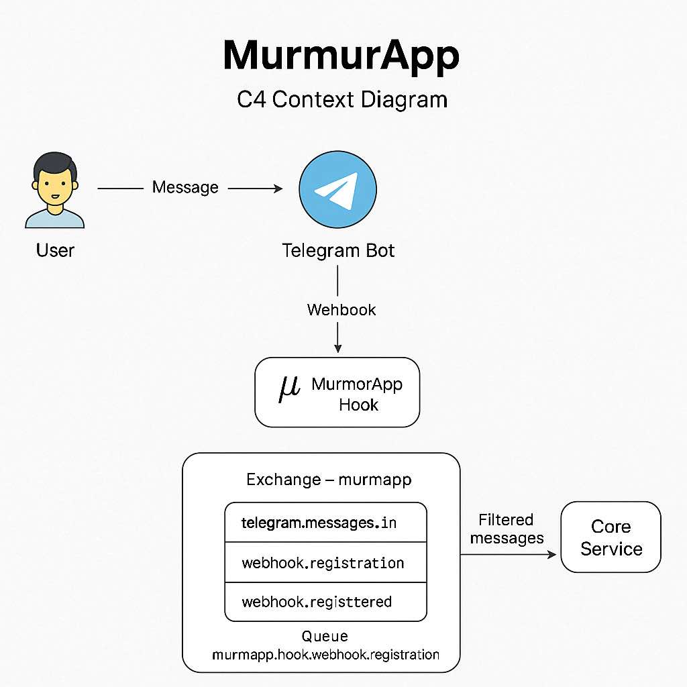
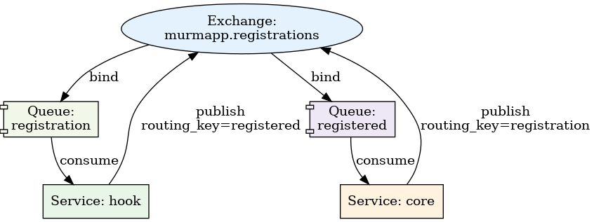

# murmapp.hook

**murmapp.hook** is a minimal Go service designed to securely receive Telegram webhook events, verify their authenticity, redact and encrypt sensitive data, and forward them as raw Protobuf messages to RabbitMQ for further processing.

---
## 📌 Features

- Secure webhook validation using SHA1(secret_token + SECRET_SALT)
- AES-GCM encryption of `telegram_id` using `TELEGRAM_ID_ENCRYPTION_KEY`
- AES-GCM encryption of `message.text`, `reply_to_message.text`, `channel_post.text` using `ENCRYPTION_KEY`
- Redaction of fields like `username`, `first_name`, `last_name` to `"[redacted]"`
- Declarative redaction paths via embedded `privacy_keys.yml`
- Forwarding of redacted+encrypted payloads via Protobuf
- RabbitMQ topic exchange integration (`murmapp`)
- Clean HTTP API using `chi` router
- Docker-compatible and GitHub Actions ready

---

## 🔐 Privacy & Security

Before forwarding any Telegram payload:

- The `hook` service checks the JSON payload against an embedded `privacy_keys.yml`
- Matching fields like `message.from.id` are AES-GCM encrypted with `TELEGRAM_ID_ENCRYPTION_KEY`
- Text values like `message.text`, `reply_to_message.text`, and `channel_post.text` are AES-GCM encrypted with a separate `ENCRYPTION_KEY`
- Identity-related fields like `username`, `first_name`, and `last_name` are replaced with `"[redacted]"`
- If no privacy keys match the payload — it is silently dropped

> `privacy_keys.yml` is embedded into the Go binary at build time via `//go:embed`

### 🔐 Example Output:

```json
{
  "message": {
    "chat": {
      "first_name": "[redacted]",
      "id": "PVu9j8yVhuevybRbuLn_7v1jA-3XRc6bmHZ4QPhk9Quilrl3fg==",
      "last_name": "[redacted]",
      "type": "private",
      "username": "[redacted]"
    },
    "date": 1745149132,
    "from": {
      "first_name": "[redacted]",
      "id": "UN2aJNsHyrrI9tV_2_X57oxY8TtY2Zn2gGOAwVfCxX-cHlHHUQ==",
      "is_bot": false,
      "language_code": "en",
      "last_name": "[redacted]",
      "username": "[redacted]"
    },
    "message_id": 182,
    "text": "08S04RXzg_j3iCakX3apH6WjyZIA49SANqgqQYSkaQThaoh257FBA=="
  },
  "update_id": 733355217
}
```
---


## ⚙️ API Specification

### Endpoint

```
POST /api/webhook/{webhook_id}
```

- `webhook_id`: extracted from the URL
- Telegram sends a special header:
  ```
  X-Telegram-Bot-Api-Secret-Token: your_secret_token
  ```
- The server computes:

  ```
  sha1(secret_token + SECRET_SALT) == webhook_id
  ```

  If the check fails, the request is rejected with `403 Forbidden`.

---

## 📡 Message Queues

### 🟩 Exchange: `murmapp`

Handles all incoming messages from Telegram via webhook.

| routing_key    | From  | To     | Description                     |
|----------------|-------|--------|---------------------------------|
| `telegram.messages.in` | hook  | core   | Redacted Telegram webhook payload (Protobuf) |

📸 Telegram message flow:  


---

The `murmapp` system uses **RabbitMQ topic exchanges** to route messages between services like `hook`, `core`, and `caster`.

### 🟦 Exchange: `murmapp`

Handles bot registration flows between `core` and `hook`.

| routing_key  | From   | To     | Description                              |
|--------------|--------|--------|------------------------------------------|
| `webhook.registration` | core   | hook   | Command to register bot webhook          |
| `webhook.registered`   | hook   | core   | Acknowledgment after successful setup    |

📸 Registration flow:  


---

### Payload

Telegram webhook JSON is **not stored as-is**. It is:
- redacted and encrypted (see `privacy_keys.yml`)
- serialized into a Protobuf payload:

```proto
message TelegramWebhookPayload {
  string webhook_id = 1;
  bytes raw_body = 2;
  int64 received_at_unix = 3;
}
```

---

### Registration Flow Payloads

Bot registration messages exchanged via `murmapp` use the following Protobuf definitions:

```proto
message RegisterWebhookRequest {
  string bot_id = 1;
  string api_key_bot = 2;
}

message RegisterWebhookResponse {
  string bot_id = 1;
  string webhook_id = 2;
}
```

---

## 🚀 Getting Started

### 1. Clone and build

```bash
git clone https://github.com/eugene-ruby/murmapp.hook.git
cd murmapp.hook
go mod tidy
go build -o app ./cmd/main.go
```

### 2. Run locally with Docker

Make sure [Docker](https://docs.docker.com/get-docker/) is installed.

```bash
docker-compose up --build
```

This will launch:

- the webhook service at `http://localhost:8080`
- RabbitMQ with management UI at `http://localhost:15672` (guest/guest)

### 3. Test the webhook

```bash
curl -X POST "http://localhost:8080/api/webhook/<webhook_id>" \
  -H "Content-Type: application/json" \
  -H "X-Telegram-Bot-Api-Secret-Token: <secret_token>" \
  -d '{"update_id": 12345, "message": {"text": "Hello"}}'
```

Replace:

- `<secret_token>` with the secret used when registering the webhook
- `<webhook_id>` with the SHA1 hash of `<secret_token><SECRET_SALT>`

You can compute it like this:

```bash
echo -n "<secret_token><SECRET_SALT>" | sha1sum
```

---

## ✅ Health Check

Simple GET endpoint:

```
GET /healthz
```

Returns `200 OK` if the service is running.

---

## 👨‍💻 For Developers

### 🧱 Project Structure

- `cmd/` — entrypoint: starts the webhook server
- `internal/` — business logic (handlers, MQ, filtering)
- `internal/config/privacy_keys.yml` — embedded YAML rules for redaction
- `proto/` — Protobuf definitions
- `.github/workflows/deploy.yml` — CI deployment flow

---

### 🔐 Required GitHub Secrets

To enable CI deployment, set the following secrets in **GitHub → Settings → Secrets and variables → Actions**:

| Secret Name                  | Description                                       |
|------------------------------|---------------------------------------------------|
| `SSH_HOST`                   | IP or hostname of your production server         |
| `SSH_USER`                   | SSH user used for deployment                     |
| `SSH_KEY`                    | SSH private RSA key (single-line format)         |
| `SECRET_SALT`                | Secret salt used for webhook verification        |
| `TELEGRAM_ID_ENCRYPTION_KEY`| 32-byte key used for AES-GCM encryption of IDs   |
| `ENCRYPTION_KEY`            | 32-byte key used for AES-GCM encryption of TEXT   |
| `RABBITMQ_URL`              | RabbitMQ connection string (AMQP URL)            |
| `WEB_HOOK_HOST`             | The domain where Telegram sends webhook events   |
| `APP_PORT`                  | Port to bind the HTTP server                     |
| `DEBUG`                     | Enable debug logs and payload tracing            |

---

### 🚀 Trigger Deployment

Create a Git tag and push it — this triggers the GitHub Actions workflow:

```bash
git tag v1.0.0
git push origin v1.0.0
```

The server will automatically:

- run `go build`
- embed privacy config into the binary
- restart the systemd service via SSH

---

## License

MIT
